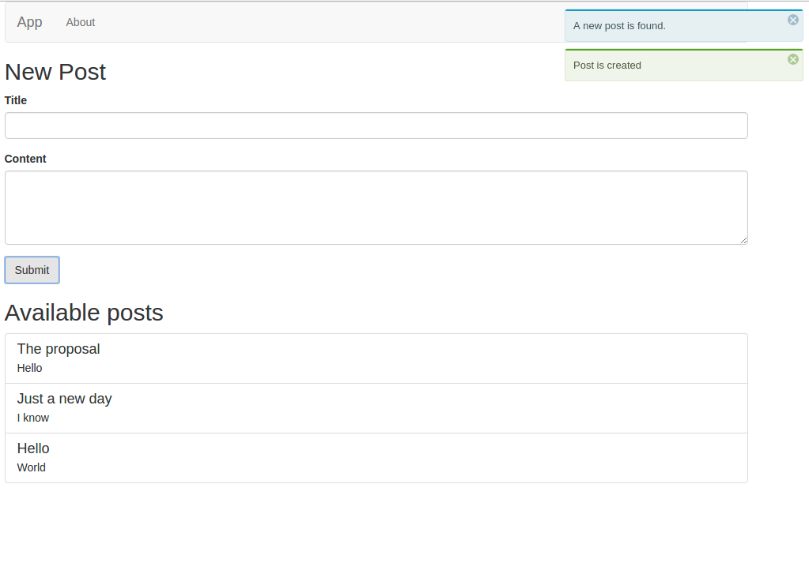

# Todo React

An example of a todo app built with React, Apollo GraphQL & Hapi.


## Overview
This example is a simplified combination of [GitHunt-React](https://github.com/apollostack/GitHunt-React/) and  [GitHunt API](https://github.com/apollostack/GitHunt-API). Through the code, you will know:
- How to work with GraphQL in general, especially GraphQL subscriptions.
- Use `react-router` for routing
- Use `react-notification-system` for notifying messages

Please submit a pull request if you see anything that can be improved!

## Running the app

### 1. Clone

```
git clone git@github.com:evolastech/todo-react.git
cd todo-react
npm install

# or if you use yarn (it works much faster than npm)
# yarn install
```

### 2. Run
Issue the command:

```
npm start
```

Open the app at http://localhost:3000, you'll see something like this screenshot:



## Directory structure
- `./api`: contains our API server's code
- `./ui`: our server-rendering frontend
